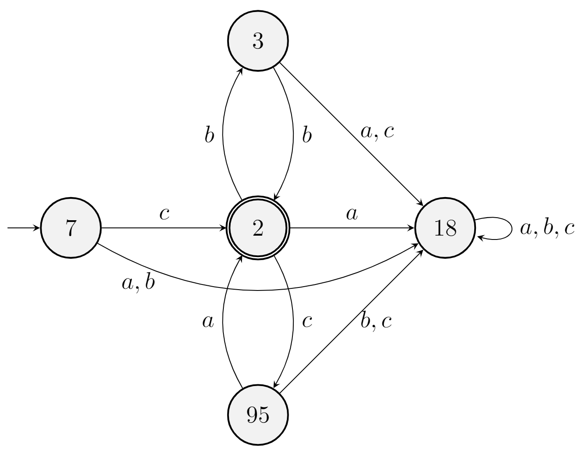
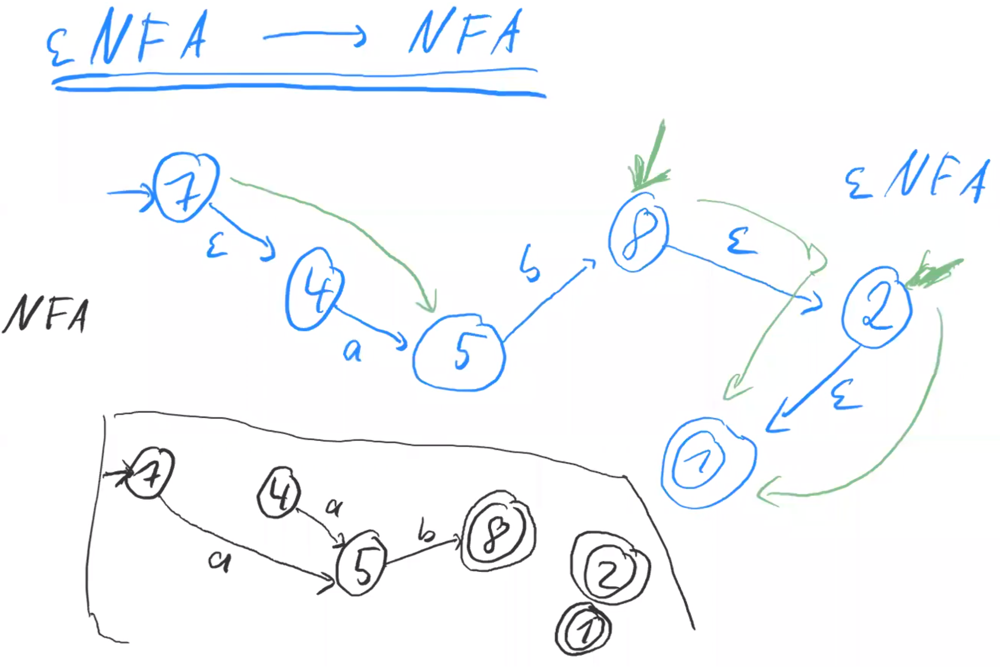
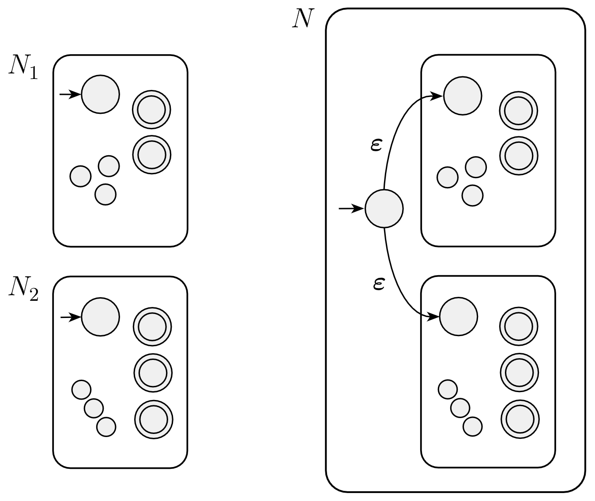
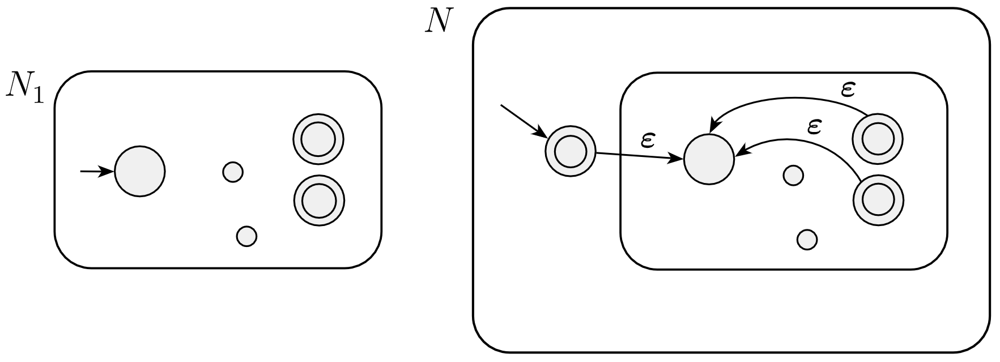

# Week 1: Regex, DFA, NFA & Kleene's Theorem

## Regular Expressions

### Definition

**Purpose:** To specify a language

**Language:** a set of words, i.e. a subset of all possible words

**Alphabet:** often called $\sum$, e.g. $\sum=\left\{a, b, c\right\}$

**All Possible Words:** $\sum^*$, e.g. $bbab\in\sum^*$

### Grammars

### Basic

Regular Expression determines a subset of words that match the regexp.

| Regexp             | Meaning                                                      |
| ------------------ | ------------------------------------------------------------ |
| a                  | Match exact a                                                |
| b                  | Match exact b                                                |
| $\epsilon$         | Match empty string                                           |
| E \| F             | Match E or F                                                 |
| EF (juxtaposition) | Match concatenation of E and F (by Order)                    |
| a(b\|c)            | Match ab or ac (Could consider b \| c as expression d, so original formula would be ad) |
| E*                 | Match E several times incl. 0 time                           |
| a*                 | Match $\epsilon$, $a$, $aa$, $aaa$, etc.                     |
| 0                  | Match no word                                                |

`|` is or (exclusive)

#### Abbreviations

$E^+ = EE^*$  
$E? = \epsilon\mid E$

#### Precedence

\+ = ? = \* \> juxtaposition > |

## Automata

### Definition

**Chinese:** 自动机

**Purpose:** Match or Reject input and do something in reaction to input

**Ingredients:**
1. States
2. Transitions (between states)



### Example

**States:** nodes  
In this example, 5 states: 7, 3, 2, 95, 18

**Transitions:** arrows between states  
E.g. $7 \stackrel{a,b}{\longrightarrow}18$

**Initial states:** a state with the **begin-free arrow**.  
In this example, is 7.

**Accepting state:** a node with double circles.  
In this example, is 2.

If a input can reach accepting state as its endpoint, then the input is accepted by the automata or it is rejected.

## Nondeterministic Finite Automata

Aka. 非确定有限状态自动机/NFA

Different from deterministic automata (DFA)
1. Can have more than 1 initial state  
   i.e. Multiple entrances
2. Can have more than 1 transition from a given state for a given input.  
   i.e. the same name transition can trans to different state  

|  |  |
| :---: | :---: |
| Rule 1 | Rule 2 |

## Determinising an NFA

$$
\text{NFA}\longrightarrow \text{DFA}
$$

|  |  |
| :--: | :--: |
| NFA | DFA |

- 因为我们有两个输入，我们可以创建第一个输入状态 `->[{3, 7}]`
- 寻找 3, 7 可执行的转换：a 和 b
- 先构建 a 操作， 7 通过 a 可达到 2 和 3，而 3 无转换，故链接 `[{3, 7}] -a-> [{2, 3}]`。
  - 接着构建 {2, 3}，其可以进行 a 和 b 转换
    - 当进行 a 转换时，2 可以到达 8，而 3 无操作，故链接 `[{2, 3}] -a-> [[{8}]]`。
      - 接着构建 8，发现其为 Accepting State，无操作
    - 当进行 b 转换 时，2 可以到达 2（环） 和 3，而 3 可以到达 8，故链接 `[{2, 3}] -b-> [{2, 3, 8}]`。
      - 接着构建 `[{2, 3, 8}]`
        - 8 为 Accepting State，无操作
        - 而剩余的 2 和 3 与上一步类似，可以到达 `[{2, 3, 8}]`，与自身相同，故指向自己，即链接 `[{2, 3, 8}] -b-> [{2, 3, 8}]`。
        - 并且其可以通过 a 转换至 `[[8]]`，链接 `[{2, 3, 8}] -a-> [[{8}]]`
- 然后构建 b 操作，7 无转换，3 可以至 8，故链接 `[{3, 7}] -b-> [{8}]`。
  - 接着构建 8，发现其为 Accepting State，无操作
- 完成 determination

## ɛ-Transitions

It occurs on ɛ-NFA

E.g.

```
-> [1] <-a-> [2] -ɛ-> [3] <-b-> [[4]]

INPUT: ab
TRANS: [1] -a-> [2] -ɛ-> [3] -b-> [[4]]
RESUL: ACCEPTED

INPUT: abba
TRANS: [1] -a-> [2] -ɛ-> [3] -b-> [[4]] -b-> [3]
RESUL: NOT ACCEPTED: DECLINED DUE TO NO TRANS FOR THE LAST a
```

## Remove Epsilon Transition



- 写下所有状态/State
- 复制所有非 ɛ 转换：`[4] -a-> [5]`, `[5] -b-> [8]`
- 思考所有 ɛ 链接
  - `[7] -ɛ-> [4] -a-> [5]`
    - 链接  `[7] -a-> [5]`，即忽略其中的 ɛ 转换
  - `[5] -b-> [8] -ɛ-> [2] -ɛ-> [[1]]`
    - 虽然进行来两次 ɛ 转换，但是我们依旧可以认为状态 8, 2, 7 是等价的 （因为其可以通过 ɛ 转换最终到达 Accepting State 1）
    - 所有我们链接
      - `5 -b-> [[8]]`：链接，并使用 `[8]` 作为 accepting state
      - `[[2]]`：不链接，使用 `[2]` 作为 accepting state
      - `[[1]]`：不链接，使用 `[1]` 作为 accepting state
- 构建入口：`->[7]`
- 完成移除

## Kleene's Theorem

### Definition

Given a language $L \subseteq \sum^*$

i. $L$ can be described by a regex

<p align="center">If and only if</p>

ii. There is a DFA that accepts exactly $L$

$$
(i) \Longleftrightarrow (ii)\\
(i) \Longrightarrow (ii)\\
(ii) \Longrightarrow (i)
$$

More focus on $(i) \Rightarrow (ii)$

### Build Automata from Regex

A regexp builds over $\left\{a, b\right\}=\sum$, could be $a$, $b$, $\epsilon$, $E_0 \mid E_1$, $E_0E_1$, $E^*$.

#### Basic Building Blocks

Basic building blocks:

| Regex | Block |
| ---- | --- |
| a |  |
| $\epsilon$  |  |
| 0 |  |

#### $E_0\mid E_1$



1. Construct an ɛNFA that recongise $E_0 \mid E_1$
2. Turn into an NFA
3. Turn into a DFA

#### $E_0E_1$


- Put $E_0$ to left, and $E_1$ to right.
- Connect all **accepting points** of $E_0$ to the **initial state** of $E_1$ with **ɛ-transition**

#### $E^*$



**实现 $\epsilon$：** 对于 ɛ，我们可以构建一个 Accepting State 作为 initial state

**实现 $\epsilon\mid E$：** 对于 $E$，我们可以使用一个 ɛ-transition 将 ɛ 与原来的 E 相连。这个操作相当于结果可以为 `-> Accept -ɛ-> E`，当输入为 ɛ，则会碰触到第一个 Accepting State，而其余则会通过 ɛ 转换跳转到后方的 E。

**实现 $\epsilon\mid E\mid EE\mid EEE\mid \cdots$:** 将原始 $E$ 的所有 Accepting State 使用 ɛ-transition 链接到原始 $E$ 的 initial state上。因此当如果匹配 $EE$ 时，会先通过第一个 ɛ-transition 到达原始 $E$ 的 init state，然后当到达 accepting state 时，再通过 ɛ-transition 到达原始 $E$ 的 init state，最后再到达 accepting state。

## References

- 有穷自动机DFA&NFA (学习笔记) - 知乎  
  <https://zhuanlan.zhihu.com/p/30009083>
- Nondeterministic finite automaton - Wikipedia  
  <https://en.wikipedia.org/wiki/Nondeterministic_finite_automaton>
- Deterministic finite automaton - Wikipedia  
  <https://en.wikipedia.org/wiki/Deterministic_finite_automaton>