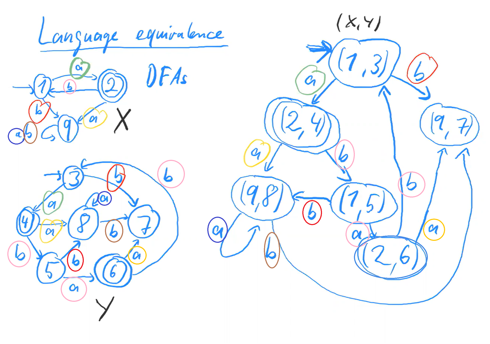
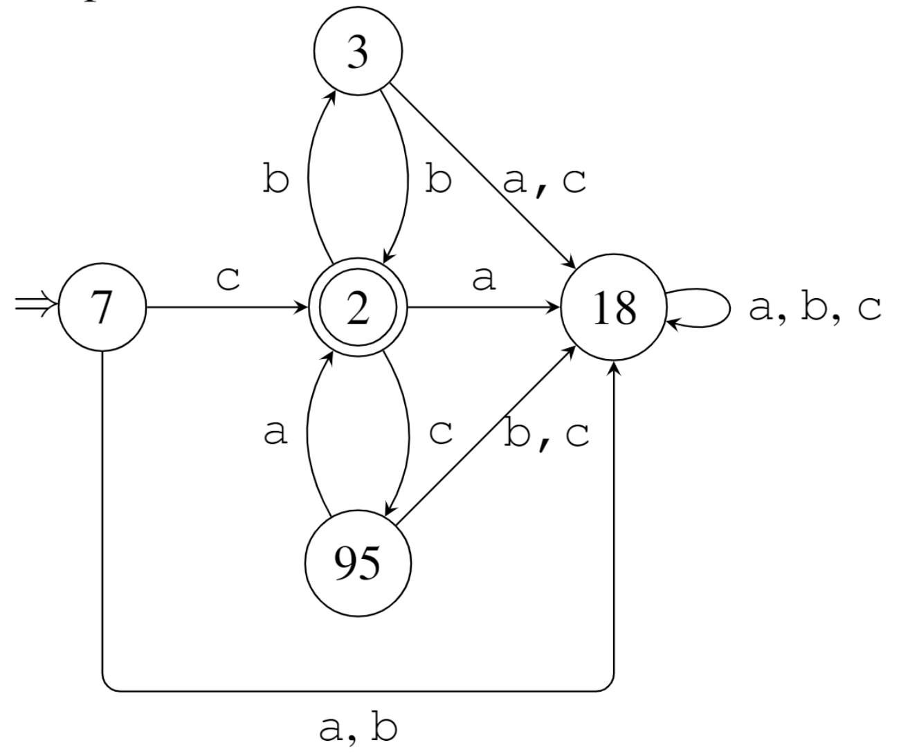
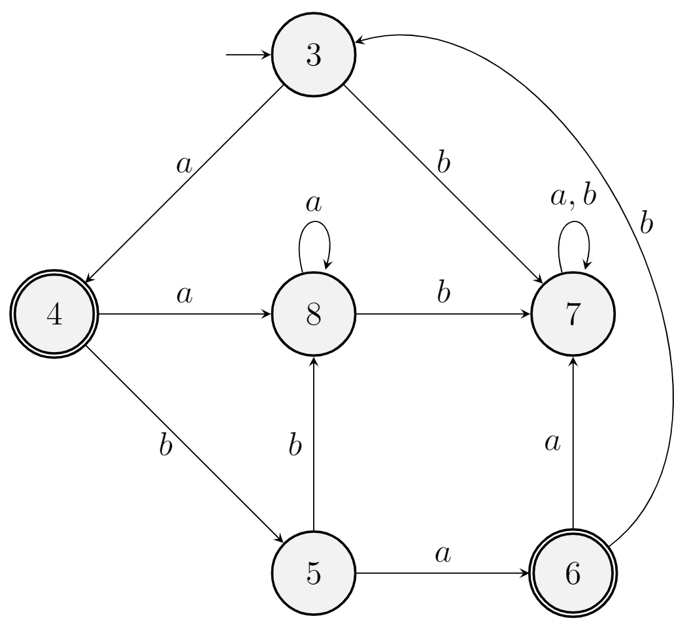
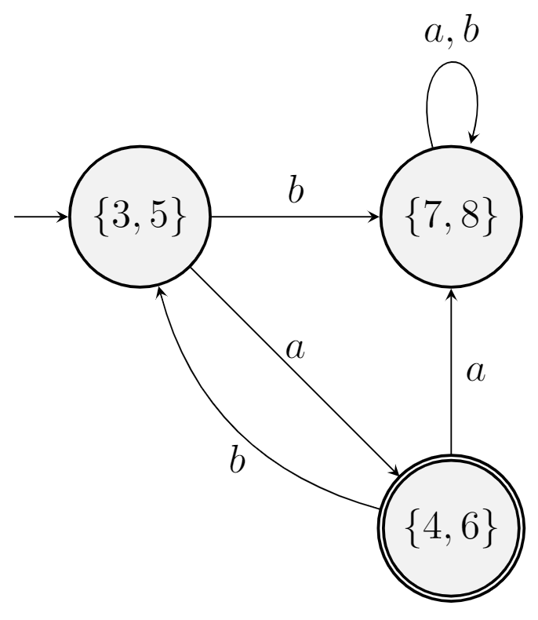

# Week 2: Equivalence, Minimal, Minimisation Automata & Non-regular Language

07/02/2022 [KevinZonda](https://github.com/KevinZonda)

## Language Equivalence



X and Y are language equivalent, they recognise the same language

## Minimal Automata

An automaton is minimal if  
It does not have any superfluous (多余的) states. (i.e., no one can be removed or merged.)

I.e.:

1. Every state is reachable
2. Every 2 distinct state are inequivalent  
   i.e. there is a word leading to an accepting state from one, but not other state.

### Example



1. Every state is reachable:

| State | Reached After |
| ----- | ------------- |
| 1     | epsilon       |
| 2     | c             |
| 3     | cb            |
| 95    | cc            |
| 18    | b             |

2. Any 2 distinct state are inequivalent:

I.e. We have to find a word that can be only accepted from one state, but not the other one.

| State | Accepted Word                              |
| ----- | ------------------------------------------ |
| 2     | 2  accept epsilon but no other states      |
| 3     | 3  accepts b, but no other states          |
| 7     | 7  accepts c, but no other states accept c |
| 95    | 95 accepts a, but no other states accept a |
| 18    | others show this is inequivalent           |

## Minimising DFA



首先发现
- Accept: `{4, 6}`
- Reject: `{3, 5, 7, 8}`

- 回溯，会发现通过 a 可以抵达 `{4, 6}`
- 我们首先绘制 a 转换
  - `{3, 5}` 可以通过 a 转换至 `{4, 6}`
  - `{7, 8}` 无法通过 a 转换至 `{4, 6}`
  - 拆分 `{3, 5, 7, 8}` 为 `{3, 5}` 和 `{7, 8}`
  - 链接 `{3, 5} -a-> {4, 6}`
以类似方式绘制所有原图的链接，直到绘制结束



我们还需要进行额外检查以展示这是 minimal 的

## Non-regular/Irregular Languages

**Q:** Are all language $L\subseteq \sum^*$ regular?  
**A:** No. There are languages that would require an automaton with infinitely state. (F in DFA is finite)


**Regular:** countable  
**$\Sigma^*$:** uncountable

Proof

$$
\begin{aligned}
  \Sigma =& \left\{(, )\right\} \\
  L =& \left\{(^i)^i \mid i \in \mathbb{N}\right\} \subseteqq \Sigma^* \\
\end{aligned}
$$

Idea: We show that $L$ is non-regular by deriving a contradiction.

We assume there is a DFA recognising $L$.

We construct this DFA:

```
->[0] -(-> [1] -(-> [2] -(-> [3] -(-> [...]
```

Suppose have state $x_n$ reached after reading $n$ "(" for any $n \in \mathbb{N}$, i.e. $\overbrace{(...(}^{n}$.

Therefore, $x_m \neq x_n$ for any $m \neq n$.

Suppose $m<n$ we want to show $x_m \neq x_n$. If we start at $x_m$ and read $)^m$, we canreach an accepting state, due to $(^m)^m\in L$.

However, if we start at $x_n$ and read $)^m$ we reach a non-accepting state, due to $(^m)^m\notin L$.

Therefore $x_m$ and $x_n$ can not be the same.

So we can get we need a $\mathbb{N}$ DFA which is not finite, so it is contradiction.
