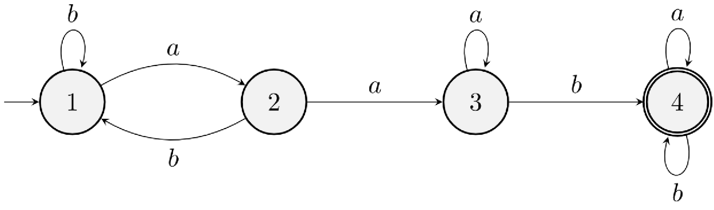
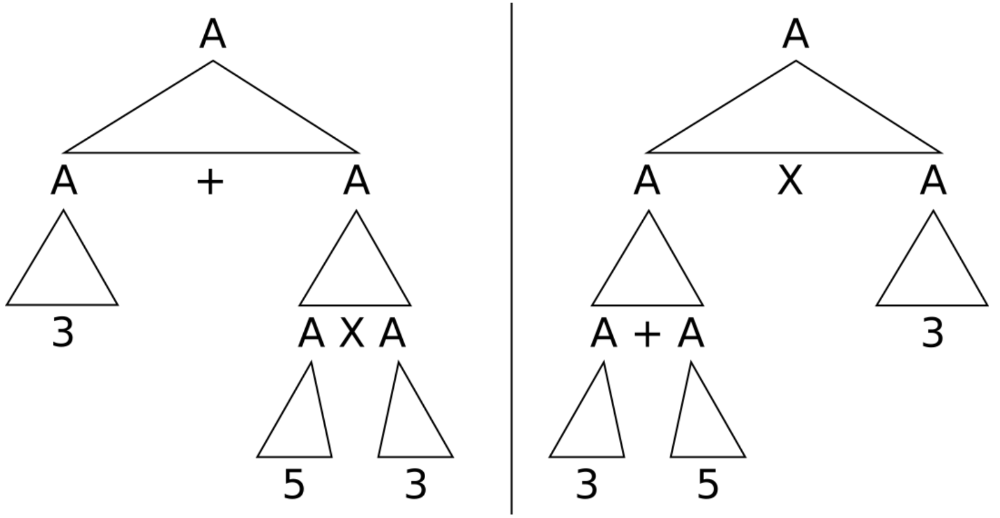

# Week 3: Induction & Context-free Language

## Induction

### Ordinary Induction

Aka. Mathematical Induction, Weak Induction

Let $P\in\mathbb{N}$

***Base Case:***  
*Proof:* $P(0)$

***Inductive Steps:***  
*Assume:* $P(n)$ (*inductive hypothesis*)  
*Proof:* $P(n)\to P(n+1)$ (i.e. $P(n+1)$ is hold)  

### Variations

We can change the successor of $n$ to what we want. I.e. $n'=n+2$ etc.

### Course-of-values Induction

Aka. Strong Induction

Let $P\in\mathbb{N}$

***Base Case:***  
*Proof:* $P(0)$

***Inductive Steps:***  
*Assume:* $n\in\mathbb{N}$ and $n\geq 0$, $\forall n'\in \mathbb{N},\ n'\in[1, n).\ P(n') \text{ is true}$  
*Proof:* $P(n)$ is True.

## Context-free Language

### Definition

**Alphabet:** $\Sigma=\left\{ +, \times, (, ), 3,5,\text{if},\text{then},\text{else},\text{and},> \right\}$

**Token:** Element of Alphabet $\Sigma$

**Production:** Symbol `::=`

We define a language by BNF:

$$
\begin{aligned}
\Rightarrow
    A &::= 3                \mid
           5                \mid
           A + A            \mid
           A \times A       \mid
           (A)              \mid
           \text{if } B \text{ then } A \text{ else } A\\
    B &::= A > A            \mid
           B \text{ and } B \mid
           (B)
\end{aligned}
$$

The $\Rightarrow$ means the entry point (or where it starts)

**Non-terminal:** $A$ and $B$

**Terminal:** characters in $\Sigma$

### Grammars

A Context-free Grammar is a 4-tuple $(V, \Sigma, R, S)$

- $V$: finite set, **Variables** or **Non-terminals**
- $\Sigma$: finite set, **Alphabet** or **Terminals**
- $R$: finite set, **Rules** or **Production**
- $S\in V$: **Start Variable**

### Language

The set of strings ($\Sigma*$) which can be generated from Grammar is called **Language of this Grammar**. Written as $\text{L}(G)$

Language produced by Context-free Grammar is known as **Context-free Language (CFL)**

### Derivation

#### Definitions

**Derivation Tree:** parse tree

#### Leftmost & Rightmost

If we think a string as a *parse tree*, **leftmost derivation** means deriving from *top to bottom* and *left to right*, and **rightmost derivation** means deriving from *top to bottom* and *right to left*.

### Matching

#### Definitions

**Parser:** Programme constructs a derivation tree for a given word 

#### Algorithms

CYK algorithm, etc.

### Designing

#### Create from DFA

1. Create variable $R_i$ for each state $q_i$ of DFA
2. Add rule $R_i ::= aR_j$ to CFG, if $\delta(q_i, a)=q_j$ is transition in DFA
3. Add rule $R_i ::= \epsilon$ to CFG, if $q_i$ is accepting state in DFA
4. Make $R_0$ as the start variable where $q_i$ is the start state of DFA

#### Example

1. Create Var. $R_1$, $R_2$, $R_3$ & $R_4$
2. Add rules:
   1. $R_1 ::= aR_2 \mid bR_1$
   2. $R_2 ::= aR_3 \mid bR_1$
   3. $R_3 ::= aR_3 \mid bR_4$
   4. $R_4 ::= aR_4 \mid bR_4$
3. Add rule:
   1. $R_4 ::= aR_4 \mid bR_4 \mid \epsilon$
4. Set start var

$$
\begin{aligned}
    \Rightarrow R_1 &::= aR_2 \mid bR_1 \\
                R_2 &::= aR_3 \mid bR_1 \\
                R_3 &::= aR_3 \mid bR_4 \\
                R_4 &::= aR_4 \mid bR_4
\end{aligned}
$$

### Ambiguity

Consider grammar:
$$
\Rightarrow A ::= A+A \mid A\times A \mid (A) \mid 3 \mid 5
$$

The word $3 + 5 \times 3$ has following unclear trees:

We need to convert the grammar to account the ***precedence*** of operators by moving the **higher priority** operations **lower** in the grammar:

$$
\begin{aligned}
    \Rightarrow A &::= A + B      \mid B \\
                B &::= B \times C \mid C \\
                C &::= (A) \mid 3 \mid 5
\end{aligned}
$$

### Chomsky NNormal Form (CNF)

#### Form

Allows rules with following kind:

$$
\begin{aligned}
    \Rightarrow A &::= B \mid C \\
                A &::= a \\
                S &::= \epsilon
\end{aligned}
$$

$S$ is start point  

#### Use

- Derivation of a nonempty word involves $2n-1$ steps where $n$ is the length of the word.
- Check mechanically: generate all derivations of length $2n-1$ and check if any of them work

#### Convert from CFG

1. Introducing new start variable
2. Remove all ε-rules of the form $A ::= \epsilon$
3. Remove all the unit productions of the form $A ::= B$
4. Patch-up/Fix grammar
5. Convert remaining rules

#### Example

$$
\begin{aligned}
   \Rightarrow
   S &::= ASA \mid aB \\
   A &::= B   \mid S  \\
   B &::= b   \mid \epsilon
\end{aligned}
$$

1. Add start var  
$$
\begin{aligned}
   \Rightarrow
   \boldsymbol{
      S_0
   }  &::= \boldsymbol{S} \\
   S  &::= ASA \mid aB    \\
   A  &::= B   \mid S     \\
   B  &::= b   \mid \epsilon
\end{aligned}
$$

2. Remove ε-rules  

- At $B$  
$$
\begin{aligned}
   \Rightarrow
   S_0 &::= S    \\
   S   &::= ASA \mid aB \mid
            \boldsymbol{a} \\
   A   &::= B \mid S \mid
            \boldsymbol{\epsilon} \\
   B   &::= b
\end{aligned}
$$

- At $A$  
$$
\begin{aligned}
   \Rightarrow
   S_0 &::= S    \\
   S   &::= ASA \mid aB \mid a \mid
            \boldsymbol{SA} \mid
            \boldsymbol{AS} \mid
            \boldsymbol{S} \\
   A   &::= B \mid S \\
   B   &::= b
\end{aligned}
$$

3. Remove Unit Rules

- Case $S ::= S$  
$$
\begin{aligned}
   \Rightarrow
   S_0 &::= S    \\
   S   &::= ASA \mid aB \mid a \mid
            SA \mid AS \\
   A   &::= B \mid S \\
   B   &::= b
\end{aligned}
$$

- Case $S_0 ::= S$  
$$
\begin{aligned}
   \Rightarrow
   S_0 &::= \boldsymbol {
      ASA \mid aB \mid a \mid
            SA \mid AS
   } \\
   S   &::= ASA \mid aB \mid a \mid
            SA \mid AS \\
   A   &::= B \mid S \\
   B   &::= b
\end{aligned}
$$

- Case $A ::= B$  
$$
\begin{aligned}
   \Rightarrow
   S_0 &::= ASA \mid aB \mid a \mid
            SA \mid AS    \\
   S   &::= ASA \mid aB \mid a \mid
            SA \mid AS \\
   A   &::= \boldsymbol{b} \mid S \\
   B   &::= b
\end{aligned}
$$

- Case $A ::= S$  
$$
\begin{aligned}
   \Rightarrow
   S_0 &::= ASA \mid aB \mid a \mid
            SA \mid AS    \\
   S   &::= ASA \mid aB \mid a \mid
            SA \mid AS \\
   A   &::= b \mid \boldsymbol {
      ASA \mid aB \mid a \mid
            SA \mid AS
   } \\
   B   &::= b
\end{aligned}
$$

4. Convert

$$
\begin{aligned}
   \Rightarrow
   S_0 &::= AC \mid DB \mid a \mid
            SA \mid AS    \\
   S   &::= AC \mid DB \mid a \mid
            SA \mid AS \\
   A   &::= b \mid  AC \mid DB \mid
            a \mid SA \mid AS  \\
   B   &::= b \\
   C   &::= SA \\
   D   &::= a
\end{aligned}
$$

#### Emptiness & Fullness

We just turn into word repeatedly until we reach the end of the word.

We cannot test whether 2 CFGs accepts *every* word over the given alphabet. It is an undecidable problem. Therefore, whether 2 CFGs accept the same word is also undecidable.

## References

1. Mathematical Induction - Stanford University - <https://web.stanford.edu/class/archive/cs/cs103/cs103.1134/lectures/04/Small04.pdf>
2. Chomsky normal form - Wikipedia - <https://en.wikipedia.org/wiki/Chomsky_normal_form>