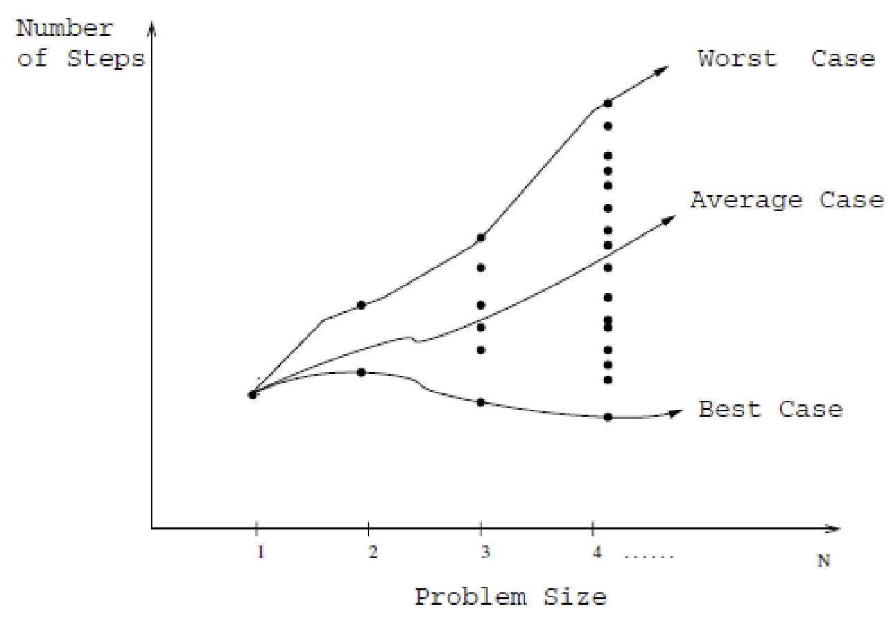
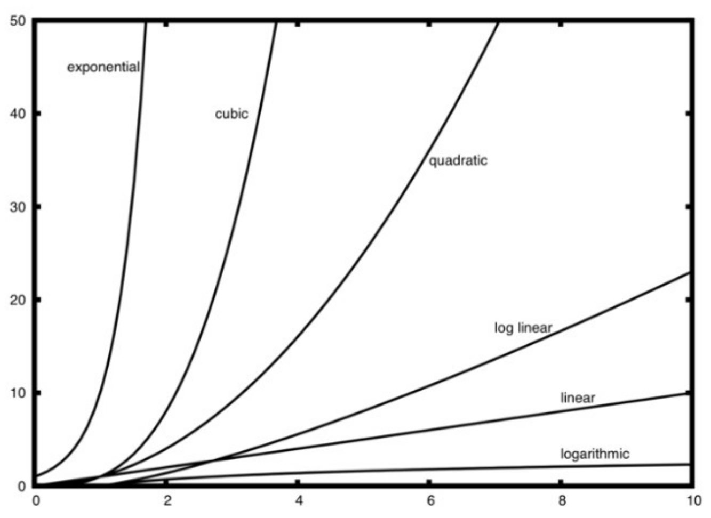

# Week 4: Complexity

## Law of Probability/可能性规则

事件 $A$ 出现的可能性（probability）被记录为 $\mathbb{P}(A)$。

事件可能性属于 [0, 1]。

对于事件 $A$，$\mathbb{P}(\neg A) = 1 - \mathbb{P}(A)$

对于事件 $A$ 和 $B$ 是互斥的（mutually exclusive），则 $\mathbb{P(A \vee B)} = \mathbb{P}(A) + \mathbb{P}(B)$

对于事件 $A$ 和 $B$ 是独立的（independent），则 $\mathbb{P(A \wedge B)} = \mathbb{P}(A) \times \mathbb{P}(B)$

## Summation Formula/累加公式

$$
\begin{aligned}
    0+1+2+\cdots + (n-1)&= \cfrac{1}{2}n(n-1)&\\
    1+2+3+\cdots + n &= \cfrac{1}{2}n(n+1)&\\
    1+b+b^2+\cdots + b^{n-1} &= \cfrac{b^{n}-1}{b-1}&(b\neq 1)\\
    1+b+b^2+\cdots + b^n &= \cfrac{b^{n+1}-1}{b-1}&(b\neq 1)
\end{aligned}
$$

对于后两个式，可以使用数学归纳法进行证明。其本质为 Faulhaber's Formula。

## Best, Avg., Worst Cases

- Worst-case complexity: 这是 _上界/Upper Bound_
- Best-case complexity: 这是 _下界/Lower Bound_
- Average-case complexity: 这是 _期待值/Expected Cost_

## Running Time

运行时间总是使用 argument 的 _size_ 进行表达。有不同方式进行定义 _size_，但是在这个模块，我们总是对待 argument 为一个在 $\Sigma$ 上的 word，而其 _size_ 则是其长度。$\Sigma$ 是最少有两个元素的有限集合。

我们使用 $T(N)$ 表示运行时间。

## Big-O Notation

$$
f(n) \text{ is } O(g(n))\\
\updownarrow\\
\exist M.\ \exist C.\ \forall n \geq M.\ \cfrac{f(n)}{g(n)} \leq C
$$

- $T(n)=n \Rightarrow O(n)$
- $T(n)=n+2 \Rightarrow O(n)$
- $T(n)=2n^2 \Rightarrow O(n^2)$
- $T(n)=n^2-3n+2 \Rightarrow O(n^2)$
- $T(n)=10n^3+1 \Rightarrow O(n^3)$
- $T(n)=n^6-75n^5+343n^4+362n \Rightarrow O(n^6)$
- $T(n)=10000 \Rightarrow O(1)$

- $O(n)$: Constant
- $O(log_2 n)$: Logarithmic
- $O(n)$: Linear
- $O(n log_2 n)$: Log Linear
- $O(n^3)$: Quadratic
- $O(n^2)$: Cubic
- $O(2^n)$: Exponential

对于 $O(2^n)$, $O(C^n)$ 这些 Exponential 的，其为 intractable，意思为理论上可以解决，但是无法在有效时间内实现。

## Space Complexity

与时间复杂度类似，只不过针对的是内存。
