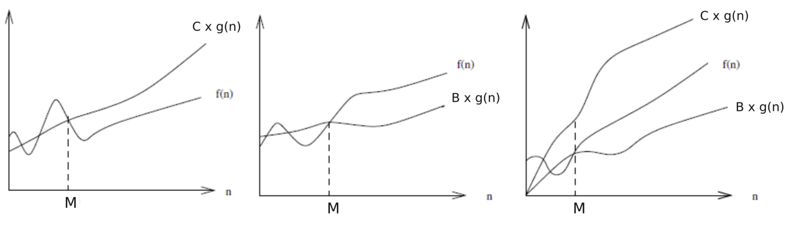
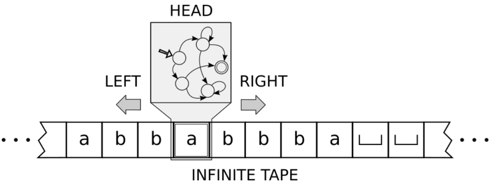
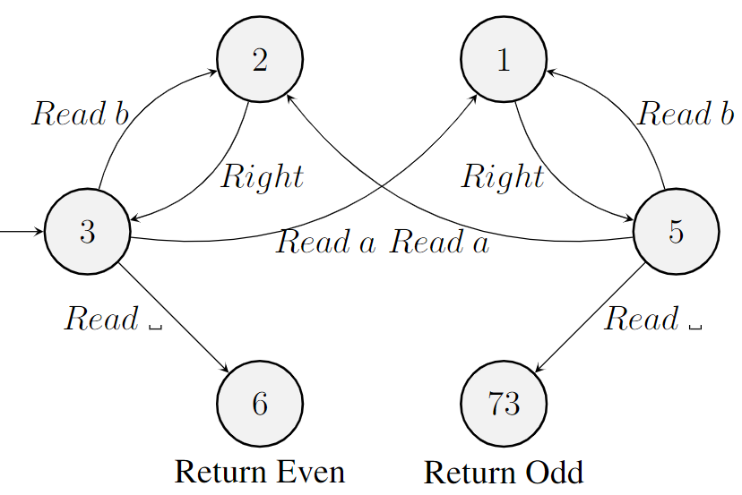
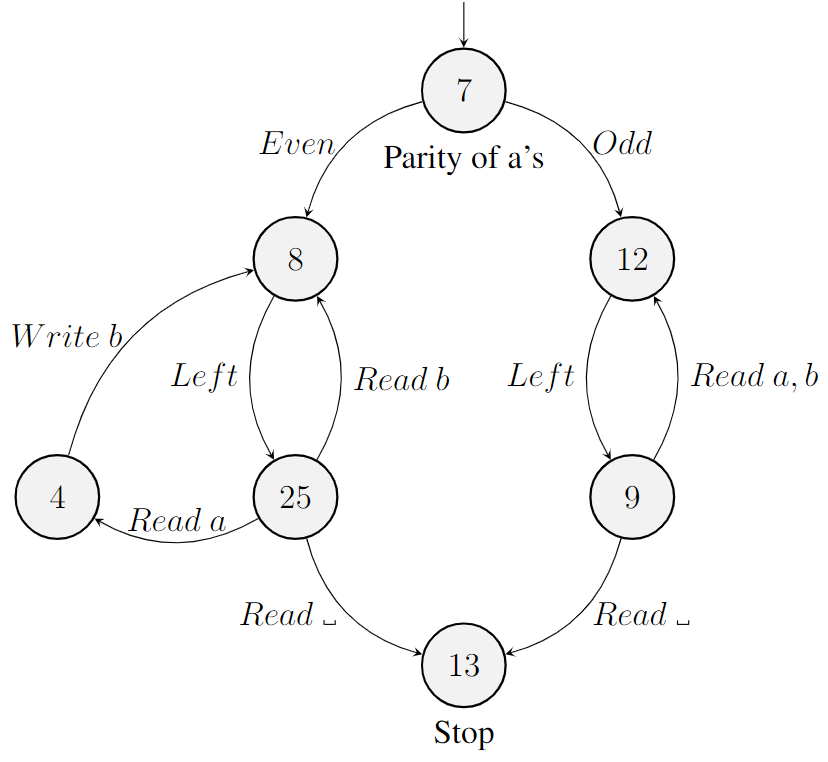
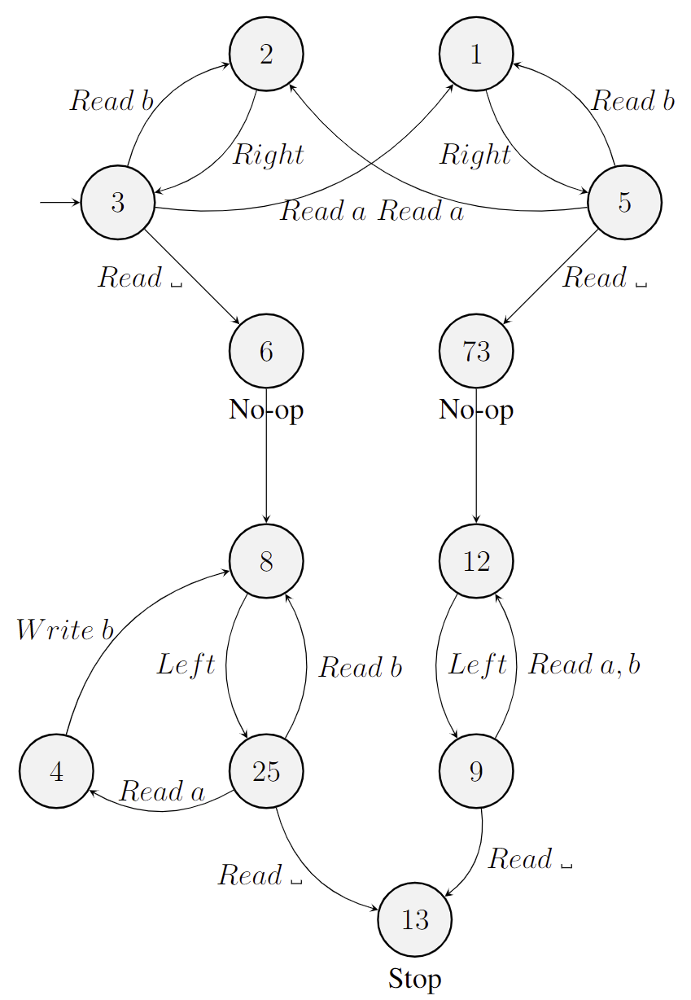
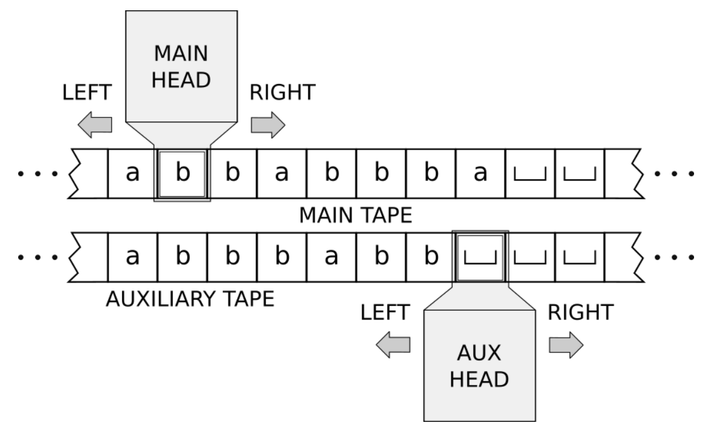
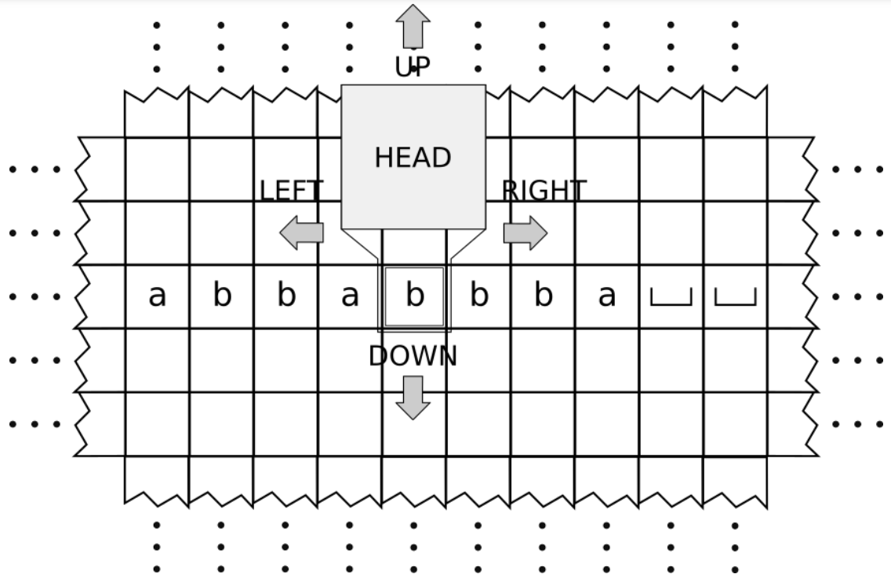

# Week 5: Turing Machine

## Complexity Notation

| Notation | Formula | Note |
| -- | -- | -- |
| $f\in O(g)$ |  $\exists M.\ \exists C.\ \forall n \geq M.\ f(n)\leq C\times g(n)$ | Upper Bound |
| $f\in \Omega(g)$ | $\exists M.\ \exists B> 0.\ \forall n\geq M.\ B\times g(n)\leq f(n)$ | Lower Bound |
| $f\in \theta(g)$ | $\exists M.\ \exists C.\ \exists B > 0.\ \forall n\geq M.\ B\times g(n)\leq f(n)\leq C\times g(n)$ | Upper & Lower Bound |

## Turing Machine

其使用一个 **无限的** tape 作为其内存，其使用 **head** 以写入或读取数据。

| 名 | 集合符号 | 示意 | 示例 |
| --- | --- | --- | --- |
| Tape Alphabet | $T$ | 包含一切可以存在于 tape 中的字符 | $T=\left\{ a, b, ␣\right\}$ | 
| Input Alphabet | $\Sigma\subseteq T$ | 一切用于输入的字符 | $\Sigma=\left\{ a, b\right\}$ |
| Return Value  | $V$ | 用于返回的集合 | $V=\left\{ \text{True},\ \text{False}\right\}$ |
| State | $X$ | 状态节点 | $X=\left\{ q_0, q_1, q_2, q_3\right\}$ |
| Initial State | $p\in X$ | 初始状态 | $p=q_0$ |
| Transition Function | $\delta$ | 状态转移函数 | See below |

$$
\begin{aligned}
T &= \{␣, a, b \}\\
V &= \{ \text{Even}, \text{Odd} \}\\
\end{aligned}
$$
我们可以定义这个 TM over $T,\ V$
$$
\begin{aligned}
&X = \{3, 2, 6, 73, 51\}
\\
&p = \{3\}
\\
&\begin{aligned}
\delta = \{\\
    &3 &\mapsto& Read(a\mapsto 1, b\mapsto 2,␣\mapsto 6 )\\
    &2 &\mapsto& Right\ 2\\
    &6 &\mapsto& Return\ \text{Even}\\
    &5 &\mapsto& Read(a\mapsto 2, b\mapsto 1, ␣\mapsto 73)\\
    &73&\mapsto& Return\ \text{Odd}\\
    &1 &\mapsto& Right\ 5\\
\}&
\end{aligned}
\end{aligned}
\\
\newcommand{\defeq}{\overset{\text{\tiny def}}{=}}
\newcommand{\ldefeq}{\mathrel{\raisebox{-0.3ex}{$\defeq$}}}
TM\defeq(X,\ p,\ \delta)
$$

对于其使用，例如：

| Tape         | State | Oper             |
| ------------ | ----- | ---------------- |
| $\dot{b}aba$ | 5     | $\text{Read }b$  |
| $\dot{b}aba$ | 12    | $\text{Right}$   |
| $b\dot{a}ba$ | 5     | $\text{Read }a$  |
| $b\dot{a}ba$ | 3     | $\text{Write }b$ |
| $b\dot{b}ba$ | 4     | $\text{Right}$   |
| $bb\dot{b}a$ | 5     | $\text{Read }b$  |

## Macro

|  |  |
| :--: | :--: |
| $\mathcal{M}_1$ | $\mathcal{M}_2$ |

如果将上文的 TM $\mathcal{M}_1$ 与 $\mathcal{M}_2$ 合并，我们可以将状态 7 看作一个 macro，因此我们可以获得：

## Variants

### Auxiliary Characters/辅助字符

对于一个 TM，我们可以认为其输入为 $\Sigma=\{a, b\}$，但是在程序之中我们可以使用一些辅助字符，我们只需要保证输出不包含其即可，例如我们可以定义 $Aux=\{a, b, a', b'\}$

### Auxiliary/Multitape TM

如果一个 TM 包含超过 1 条 Tape：

### 2 Dimensional TM

