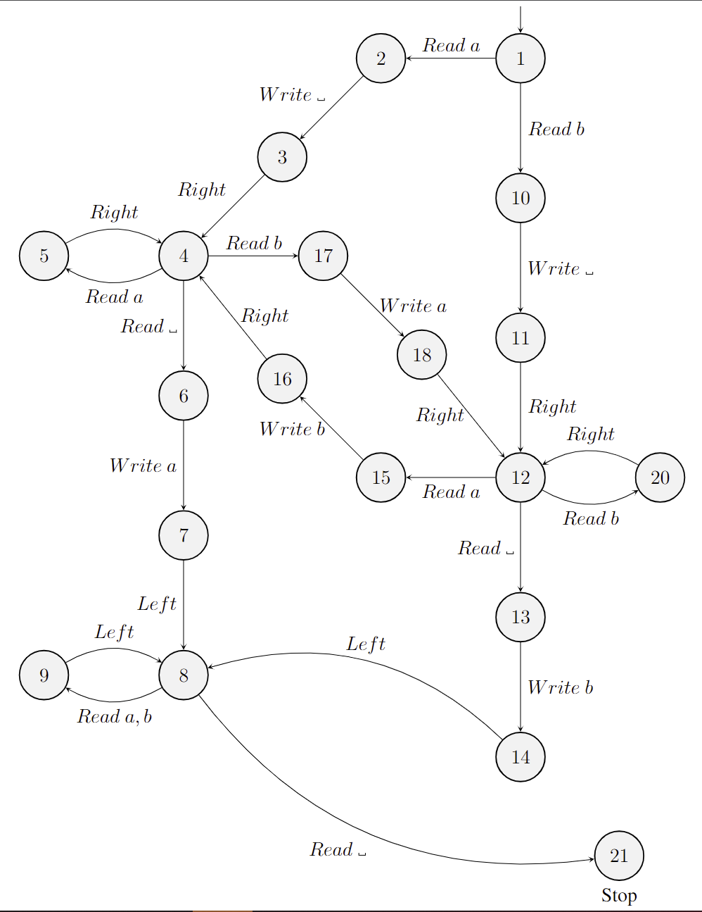

# Week 6: Converting Fancy Turing Machines to Simple Machines

## Time vs. Space Efficiency/时间 vs 空间效率

Size of block: 10

这个 TM 执行 1000 步如果写最高可以消耗 510 个单元（全部向左，每个操作组为 `[Left, Write]`）而如果不写则可以消耗 1010 个单元格，而最小可以消耗 10 个单元（全部操作均在内）

因此时间复杂度和空间复杂度均为 $O(n^2)$

## Aux. Characters

通常来说，我们需要 Aux 以方便 TM 工作，例如 $\Sigma=\{a, b, ␣\}$, $Aux=\{c, d\}$

对于**包含** Aux. Char. 的 TM，我们称其为 Fancy TM。  
对于**没有** Aux. Char. 的 TM，我们称其为 Simple TM 或者 Ordinary TM。

## Convert Program

我们可以通过一个通用的方法转换 Fancy TM 至 Simple TM：
1. Define Relation  
   给出 Fancy TM 和 Simple TM 配置的关系，换句话说如何用 Simple TM 来模拟 Fancy TM
2. Setting-up Program  
   给出用于转换 Fancy TM 至 Simple TM 初始配置（initial configuration）的程式
3. Simulating Program  
   给出用于模拟 Fancy TM 的 Simple TM 的程式（换句话说，如何模拟 Fancy TM 的每一步）
4. Finishing Program  
   给出用于转换 Simple TM 结果至 Fancy TM 结果的程式

通常来说上述过程为多项式时间（polynomial time）

**关键点：** 一个 polynomial time 的 Fancy TM 可以被转化为 polynomial time 的 Simple TM。

### Step 1: Define Relation

Def: $\Sigma = \{a, b, ␣\},\ Aux=\{c, d\}$

| Char. on Fancy TM | Represented on Simple TM |
| :---------------: | :----------------------: |
|         a         |            aa            |
|         b         |            bb            |
|         c         |            ab            |
|         d         |            ba            |
|         ␣         |            ␣␣            |

E.g,
$$
ac\dot{b}ccda \Rightarrow aaab\dot{b}bababbaaa
$$

### Step 2: Setting-up Program: Converting Initial Configurations

对于这个程序，我们读入原始配置需要 $O(n)$，然后写入重复字符，总共需要 $O(n^2)$ 步。

### Step 3: Simulating Program: Performing Fancy TM Instructions

Then, combine them:

### Step 4: Finishing Program: Converting Simple to Fancy TM's Output

与 Setting-up Program 相同，这个程序需要 $O(n^2)$ 步。

### Time Complexity

- 在拉伸程序（Setting up）时间复杂度为 $O(n^2)$
- 模拟一次是常量时间 $O(1)$，但是需要模拟 $n$ 次，因此为 $O(n)$
- 最后的压缩程序（finishing）为 $O(n^2)$

因此这个 Simple TM 使用多项式时间运行。

## 2-Tape TM

对于 2-Tape TM 我们使用如下转换过程

``
2-Tape TM -> Single-Tape Fancy TM -> Single-Tape Simple TM
``

例如：

$$
\begin{aligned}
&\text{Main}& &a\dot{b}aab\\
&\text{Aux}& &baa\dot{b}bb
\end{aligned}
$$

可以转化为

$$
\dot{L}\_a\_bHb\_a\_a\_a\_aHb\_b\_b\_\_\_bR
$$

对于转换关系我们可以模拟为如下：

对于每一组 $\langle q_{Main}, q_{Aux}\rangle$ 会被解析为 $\langle h_{Main}, q_{Main}, h_{Aux}, q_{Aux}\rangle$
- $h$ 表示 head 的状态，如果 Main 的 Head 在这一组，则会被解析为 $\langle H, q_{Main}, h_{Aux}, q_{Aux}\rangle$，如果不是则为 $\_$
- 因为每组都会被解析为 4 位，而第一位永远为 Main Head Flag，第三位为 Aux Head Flag，因此无需记录是哪个 H 在表示 Main，哪个表示 Aux

## Convert Program for 2-Tape TM

We use following as example:

$$
\begin{aligned}
&\text{Main}& &\dot{a}babb\\
&\text{Aux}& &\dot{\_}\_\_\_\_
\end{aligned}
$$

### Step 1: Setting-up Program

Convert to fancy TM.

$$
\dot{L}HaH\_\_b\_\_\_a\_\_\_b\_\_\_b\_\_R
$$

### Step 2: Simulating Program

The Write Main b instruction:

The Read Aux instruction:

### Step 3: Finishing Program

For example:

$$
\dot{L}Hb\_\_\_b\_\_\_a\_\_\_a\_\_\_b\_\_\_bH\_R
$$

After convert

$$
\begin{aligned}
&\text{Main}& &\dot{b}baabb\\
&\text{Aux}& &\_\_\_\_\_\dot{\_}
\end{aligned}
$$

Which is equivalent to $\dot{b}baabb$.

## 2D TM

对于内容
$$
\_ab\_ba\\
ab\dot{a}bb\_\\
\_\_ba\_\_
$$

可以被表示为

$$
TL\_ab\_baRLab\dot{a}bb\_RL\_\_ba\_\_RB
$$

其中 $T$ 表示 Top，$L$ 表示 Left，$R$ 表示 Right，$B$ 表示 Bottom

为了方便展示，我们可以拆分结果为

$$
\begin{aligned}
&TL & \_ab\_ba      & &RL\\
&   & ab\dot{a}bb\_ & &RL\\
&   & \_\_ba\_\_    & &RB
\end{aligned}
$$